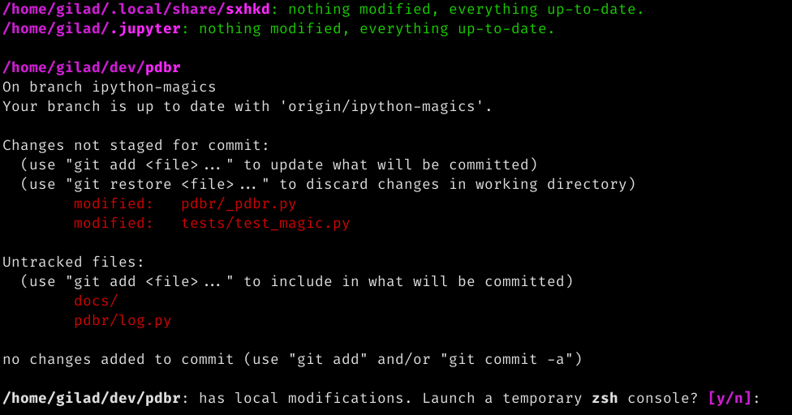

**************
too-many-repos
**************

A CLI tool to view and perform basic git actions on repos and gists residing under a given directory.

Example::

    tmr ~

This makes ``tmr`` walk down the directory tree, display the status of each repo it finds, and prompt you to perform a git action if something is out of sync.

Install
=======

Clone the repo, ``poetry install`` it, and link or alias the ``bin/tmr`` file that was created inside the virtual environment dir.

.tmrignore and .tmrrc.py
========================
Looked for in ``PARENT_PATH`` and ``$HOME``.

**.tmrignore**

Each line is a ``STRING_OR_ADV_REGEX`` and is processed as if passed via ``EXCLUDE`` option.
Lines that start with ``#`` are not parsed.

Example ``.tmrignore``::

  1 /mnt/.*
  2
  3 # .profile (gist id)
  4 c123f45ce6fc789c0dfef1234fd5bcb6
  5 gilad/Music
  6
  7 # .gist description
  8 Visual Studio Code Settings
  9 foo\-\d{4}

**.tmrrc.py**

A file containing a config object with the following settable attributes:

.. code-block:: python
  
    config.verbose: int = 0
    config.max_workers: int = None
    config.max_depth: int = 1
    config.difftool: str = 'diff'
    config.gitdir_size_limit_mb: int = 100
    config.cache.mode: 'r' | 'w' | 'r+w' = None
    config.cache.path: str = '$HOME/.cache/too-many-repos'
    config.cache.gist_list: bool = None
    config.cache.gist_filenames: bool = None
    config.cache.gist_content: bool = None

Note that cmdline opts have priority over settings in ``.tmrrc.py`` in case both are specified.

Screenshots
===========

**A confirmation prompt when running ``tmr``:**

**A repo that can be fast-forwarded was found:**

.. image:: ./docs/git-pull-prompt.png

**A repo with local changes was found:**

Usage
=====

::

  tmr [OPTIONS] [PARENT_PATH]

  PARENT_PATH defaults to current directory.

  -e, --exclude STRING_OR_ADV_REGEX : STR
                                  Filters out directories and gists.
                                  Excluding PATHS by specifying:
                                  - Can be bare ("myprojects"), which skips a dir if any of its parts match;
                                  - Composed ("myprojects/myrepo"), which skips a dir if a substring matches;
                                  - Absolute ("/home/myself/myprojects"), which skips a a dir if it startswith.
                                  Excluding GISTS by specifying:
                                  - File name (will not ignore other files in same gist)
                                  - Gist id
                                  - Gist description (or part of it)
                                  To exclude directories or gists with REGEX:
                                  See Ignore and configuration files section for examples.
                                  Can be specified multiple times.  [default: ]

  -q, --quiet                     Flag.  [default: False]

  --gists                         Look for local files that match files in own
                                  gists and diff them. Flag.  [default: False]

  --repos / --no-repos            Don't do any work with git repositories
                                  [default: True]

  --no-fetch                      Don't fetch before working on a repo. Flag.
                                  [default: False]

  -h, --help                      Show this message and exit.

  -v, --verbose LEVEL : INT       Can be specified e.g -vvv [default: 0]

  --cache-mode MODE : STR         "r", "w", or "r+w" to write only if none was read [default: None]

  --max-workers LIMIT : INT       Limit threads and processes [default: None]

  --max-depth DEPTH : INT         [default: 1]

  --difftool PATH : STR           [default: "diff"]

  --gitdir-size-limit SIZE_MB : INT      A dir is skipped if its .git dir size >= SIZE_MB [default: 100]